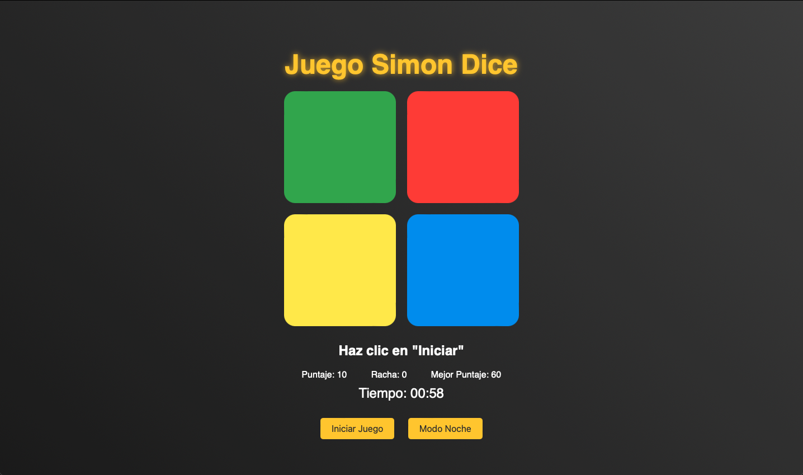

# SIMON DICE

¡Bienvenido al juego Simon Dice! Este es un juego interactivo basado en el clásico Simon Dice, donde debes seguir una secuencia de colores que el juego te muestra. A medida que avanzas, la secuencia se vuelve más larga y desafiante.

## Descripción

El objetivo del juego es seguir correctamente la secuencia de colores mostrada por el juego. Cada nivel agrega un nuevo color a la secuencia. Si fallas en seguir la secuencia correcta, el juego termina y se muestran tus estadísticas.

### Capturas de Pantalla

Aquí tienes algunas capturas de pantalla del juego en acción:



### Características

- Secuencia de colores aleatoria que aumenta de longitud con cada nivel.
- Botones interactivos con efectos visuales y sonidos.
- Temporizador de 60 segundos.
- Sistema de puntaje y racha.
- Modal de fin de juego que muestra estadísticas y el puntaje final.
- Modo de día/noche para cambiar el tema del juego.


### Tecnologías Utilizadas

- **HTML**: Estructura del contenido.
- **CSS**: Estilos y diseño visual.
- **JavaScript**: Lógica del juego e interactividad.

### Instrucciones de Uso

1. **Clonar el repositorio**

   Clona el repositorio en tu máquina local usando Git:

   ```bash
   git clone https://github.com/tu-usuario/simon-dice.git

2. **Instalar Dependencias**

No hay dependencias adicionales para este proyecto, pero asegúrate de tener un navegador moderno para ejecutar el juego.

3. **Ejecutar el Juego**

Abre el archivo index.html en tu navegador para jugar.

